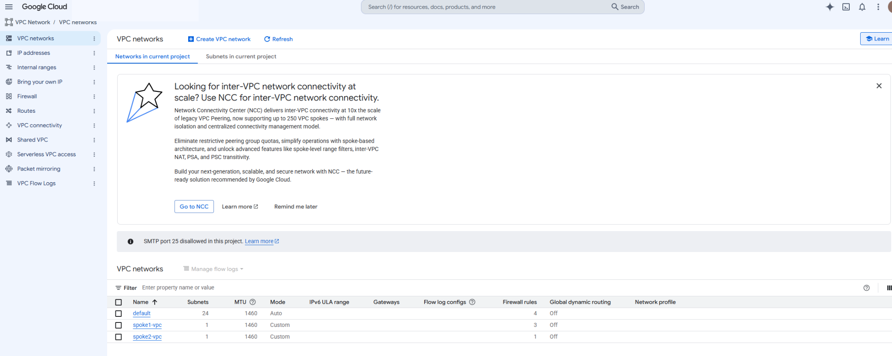
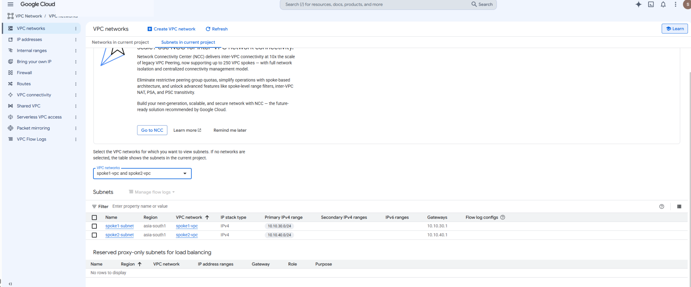
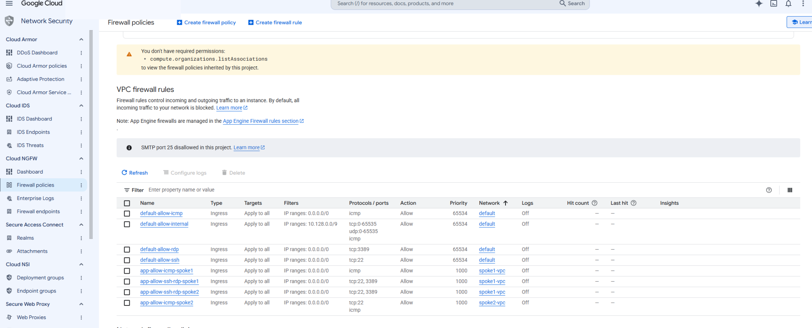
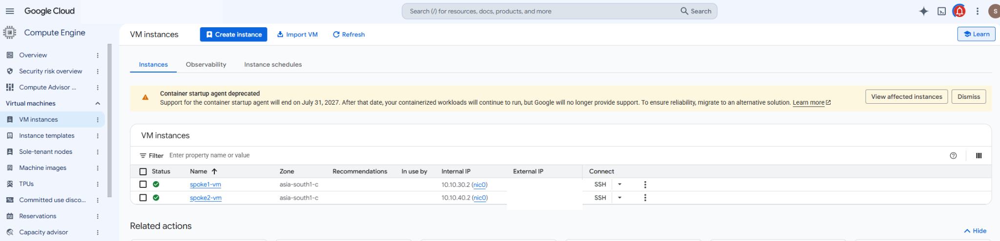
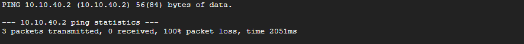
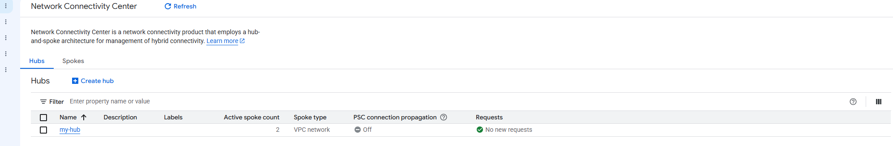
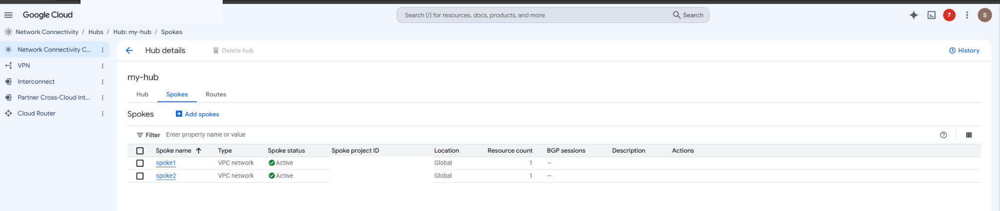
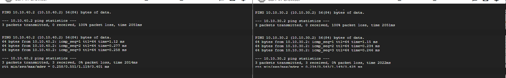
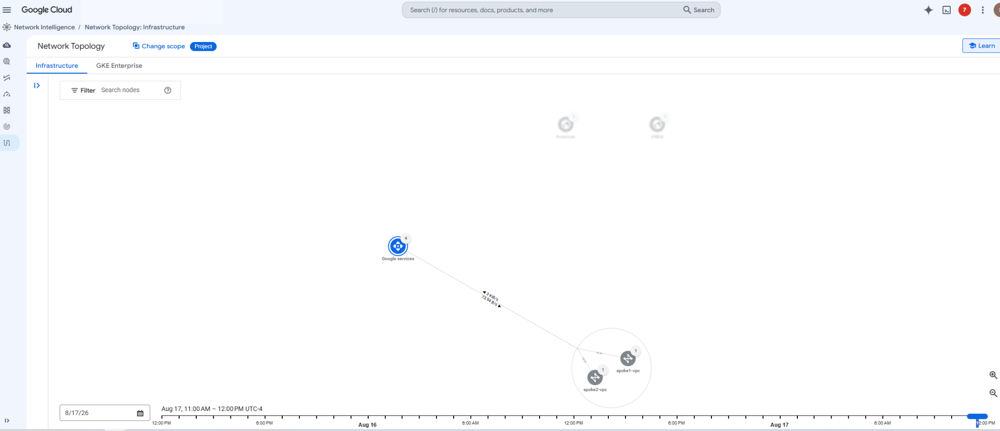

# Implement a Hub-and-Spoke Network Using Network Connectivity Center

This repository documents a hands-on Google Cloud training lab where I built a hub-and-spoke design with Network Connectivity Center (NCC). The goal was to start with two isolated VPC networks, verify that they could not communicate over their internal addresses, connect them through an NCC mesh hub, and then prove that connectivity worked afterward.

> **Training context:** This was completed in a temporary Google Cloud Skills Boost lab environment. It was not a production deployment.

## What I Worked With

- Google Cloud VPC networks and subnets
- Compute Engine virtual machines
- VPC firewall rules
- Network Connectivity Center
- VPC spokes
- Mesh hub topology
- Private IP connectivity testing with `ping`
- Network Intelligence Center / Network Topology

## Starting Architecture

| Component | Configuration |
|---|---|
| Spoke 1 VPC | `spoke1-vpc` |
| Spoke 1 subnet | `spoke1-subnet` — `10.10.30.0/24` |
| Spoke 1 VM | `spoke1-vm` — `10.10.30.2` |
| Spoke 2 VPC | `spoke2-vpc` |
| Spoke 2 subnet | `spoke2-subnet` — `10.10.40.0/24` |
| Spoke 2 VM | `spoke2-vm` — `10.10.40.2` |
| NCC hub | `my-hub` |
| Hub policy | Mesh topology |

## 1. Review the Existing VPC Environment

I started by reviewing the two VPC networks that were already provided in the lab.



The two subnets were in separate VPCs and used different RFC1918 address ranges.



### What I Learned

The lab started with two separate custom VPCs rather than one shared network. That gave me a clear baseline for testing what changed after Network Connectivity Center was introduced.

### Why It Mattered

I wanted to verify the original network boundaries before changing the architecture. Without that baseline, a successful ping later would not prove that NCC was responsible for the new connectivity.

---

## 2. Review the Lab Firewall Rules

The environment already included rules that allowed ICMP and remote administration traffic for the lab.



### What I Learned

Firewall policy and routing are separate parts of connectivity. An allow rule does not create a route between two VPCs by itself.

### Why It Mattered

The ICMP rules allowed me to use ping as a clean connectivity test. Before NCC was configured, the traffic still failed because the VPCs did not have a path to each other.

> **Lab note:** Some preconfigured rules used broad `0.0.0.0/0` source ranges. I treated those as training-only settings. In a production environment I would restrict administrative access to trusted sources and use a design appropriate for the environment.

---

## 3. Create a VM in Each VPC

I created one VM in each spoke network so I could test communication between the two private address spaces.



### What I Learned

The VM internal addresses matched the subnet ranges I reviewed earlier:

- `spoke1-vm` used `10.10.30.2`
- `spoke2-vm` used `10.10.40.2`

### Why It Mattered

These VMs became the endpoints for the before-and-after connectivity test. I could test the same private IPs before and after the architecture change.

---

## 4. Verify Connectivity Fails Before NCC

From `spoke1-vm`, I tested the private address of `spoke2-vm`. The test returned 100% packet loss.



I repeated the test in the opposite direction and saw the same result.


### What I Learned

Even though ICMP was allowed by the lab firewall configuration, the VPCs were still isolated from each other before a connectivity mechanism was added.

### Why It Mattered

This gave me the control test for the lab. Both directions failed before NCC, which made the later successful tests meaningful.

---

## 5. Build the Network Connectivity Center Hub and Spokes

I created an NCC hub named `my-hub` using the mesh topology policy and attached both VPC networks as VPC spokes.



The hub showed two active VPC spokes: `spoke1` and `spoke2`.



### What I Learned

NCC provides a centralized model for connecting VPC networks. Instead of managing individual pairwise peering relationships, I attached each VPC to the hub as a spoke.

### Why It Mattered

The hub-and-spoke model simplified the connectivity design and gave the two VPCs a way to exchange subnet routes through a centrally managed architecture.

---

## 6. Retest Connectivity After NCC

After both spokes were active, I repeated the same private IP tests. Both directions changed from 100% packet loss to successful replies with 0% packet loss.



### What I Learned

The before-and-after test made the effect of the NCC configuration easy to see. The endpoints and private IPs stayed the same; the network architecture changed.

### Why It Mattered

This was the main validation step. It confirmed that the two spoke networks could communicate after the hub-and-spoke design was in place.

---

## 7. Review Network Topology

I finished by opening Network Topology to view the VPC entities and traffic metrics in the environment.



### What I Learned

Network Topology gives me a visual way to inspect network entities and traffic rather than relying only on configuration pages and command-line tests.

### Why It Mattered

The connectivity tests told me whether traffic worked. The topology view added operational context by showing network entities and traffic activity from another perspective.

## Key Takeaways

- Two VPC networks can remain isolated even when firewall rules allow the protocol being tested.
- I need both policy and a valid network path for traffic to succeed.
- NCC VPC spokes provide a centralized way to connect multiple VPC networks through a hub.
- A before-and-after test is a useful way to validate that an architecture change actually caused the expected result.
- Network Topology can supplement command-line testing with visual traffic and infrastructure context.

## Repository Structure

```text
google-cloud-network-connectivity-center-hub-spoke-lab/
├── README.md
├── .gitignore
├── docs/
│   └── lab-notes.md
└── evidence/
    ├── 01-preconfigured-vpc-networks.png
    ├── 02-preconfigured-subnets.png
    ├── 03-preconfigured-firewall-rules.png
    ├── 04-spoke-vms-created.png
    ├── 05-spoke1-to-spoke2-before-ncc-failed.png
    ├── 06-spoke2-to-spoke1-before-ncc-failed.png
    ├── 07-ncc-hub-created.png
    ├── 08-ncc-active-vpc-spokes.png
    ├── 09-connectivity-before-after-ncc.png
    └── 10-network-topology-vpc-traffic.png
```

## Notes

This repository is documentation of a guided training lab. The screenshots were cleaned before publication to remove temporary lab identifiers and public IP addresses that were not needed to explain the work. Private RFC1918 addresses were kept because they are part of the network design and connectivity evidence.
